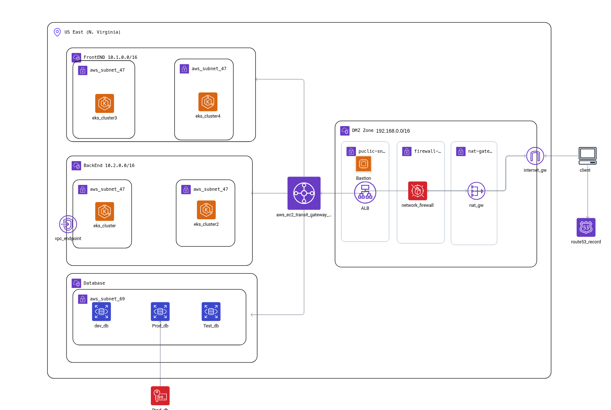
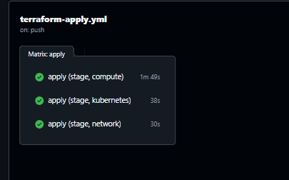
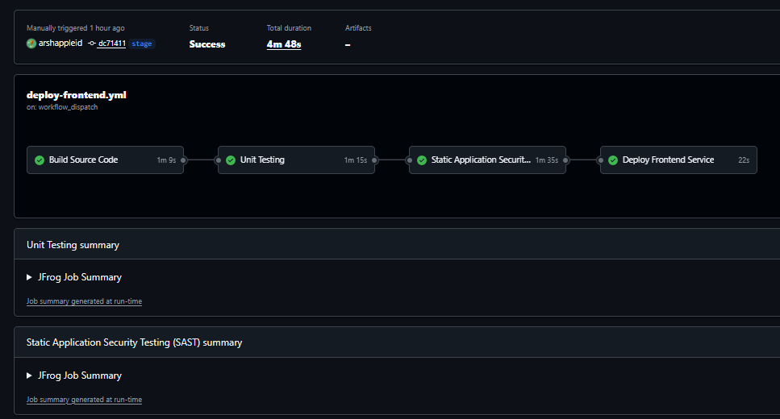
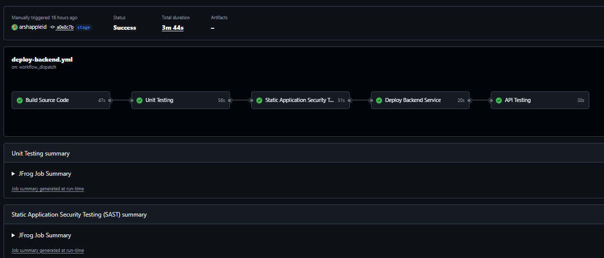
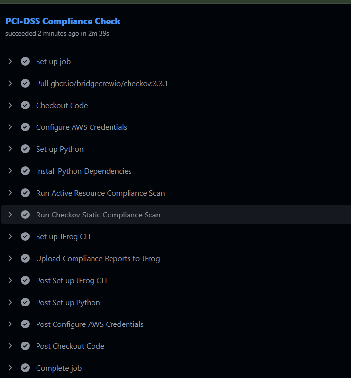

# FinanceGuard Infrastructure & Observability
**Comprehensive Systems Overview**

A deep dive into our Terraform, CI/CD, and Telemetry architecture.

---

# 🛠️ Stack Overview

Our end-to-end PCI-DSS compliant architecture integrates the following core tools:

| Category | Tool | Purpose |
|----------|------|---------|
| **IaC** | **Terraform** | Automated provisioning of AWS environments (`dev`, `stage`, `prod`, `shared`). |
| **Orchestration** | **AWS EKS** | Managed Kubernetes hosting distinct frontend & backend microservices. |
| **Networking** | **Transit Gateway** | Central hub routing traffic through the shared Inspection VPC spoke. |
| **Ingress** | **Nginx** | Reverse-proxying public web traffic to internal application endpoints. |
| **Metrics** | **Prometheus / Grafana** | Unified metrics scraping, dashboards, and alerting. |
| **Logs & Tracing** | **Loki / Jaeger** | Central container log aggregation and distributed tracing. |

---

# 🏗️ Core Infrastructure Architecture

- **AWS EKS Clusters:** Distinct clusters for `Frontend` and `Backend` applications across multiple environments (`dev`, `stage`, `prod`).
- **Transit Gateway Networking:** Hub-and-spoke VPC model connecting frontend, backend, and shared inspection VPCs.
- **Centralized Tagging:** All AWS resources are globally tagged (e.g., `Owner: Prabhmeet`) via Terraform's `default_tags` block to guarantee 100% tag coverage.
- **State Management:** Terraform state securely stored remotely in S3, leveraging native S3 conditional writes for state locking (no DynamoDB required!).

---

# ⚙️ Infrastructure CI/CD (Terraform)

- **OIDC Authentication:** Zero hardcoded credentials. GitHub Actions assumes an IAM Role using OpenID Connect (`AWS_ROLE_ARN`).
- **3-Tiered Workflows:**
  - `Plan`: Runs on Pull Requests.
  - `Apply`: Runs on pushes to `dev`, `stage`, and `prod` branches.
  - `Drift Detection`: Runs on a daily cron schedule to catch manual console changes.
- **Smart Path Filtering:** Pipelines use `paths-filter` to skip execution if no files in that specific environment/layer were modified.

---

# 🚀 Application CI/CD (Frontend & Backend)

- **Microservice Workflows:** Isolated build/test/deploy pipelines.
- **Container Verification:**
  - Docker builds targeting `linux/amd64`.
  - Push to secure ECR repositories.
  - Semgrep SAST and Trivy vulnerability scans.
  - Automatic JFrog CLI reports upload.
- **GitOps CD:** Deployments are triggered automatically through ArgoCD config sync.

---

# 🛡️ Continuous Compliance Pipeline

- **Static Resource Audits:** Checkov scans Terraform configurations.
- **Active Resource Audits:** Custom python boto3 compliance script audits security groups, S3 encryption, public blocks, and EKS logging configuration in live AWS accounts.
- **Report Archival:** Auto-uploads compliance reports to JFrog repository.

---

# 🚪 Bastion Server & Ingress

- **Spot Instance Compute:** Runs on a `c5.2xlarge` AWS Spot Instance (8 vCPUs, 16GB RAM) to optimize performance-to-cost.
- **Network Placement:** Located in the shared Inspection VPC public subnet with a static Elastic IP (EIP).
- **Nginx Reverse Proxy:** Routes incoming traffic seamlessly on standard Port 80 based on URL sub-paths, hiding internal application ports from the internet.

---

# 📊 Observability Stack

A complete, Dockerized monitoring suite running on the Bastion server.

- **Grafana Dashboard:** `http://<bastion-ip>/grafana/` (Centralized metrics & logs visualization)
- **Prometheus Server:** `http://<bastion-ip>/prometheus/` (Raw metrics storage & alerts)
- **Jaeger Tracing:** `http://<bastion-ip>/jaeger/` (Distributed transaction trace search)
- **Loki Logger:** `http://<bastion-ip>/loki/` (Container log ingestion endpoint)
- **Argo CD Console:** `http://<bastion-ip>/argocd/` (GitOps deployment dashboard proxy)

---

# 📡 Application Telemetry (FastAPI)

Zero-code auto-instrumentation using the **OpenTelemetry (OTel)** standard.

- **Metrics:** Replaces standard Prometheus clients. Automatically calculates Request Rates, Latency Histograms, and Error Rates.
- **Logs:** Injects trace context into standard Python logging, exporting directly to the OTel collector.
- **Traces:** Uses `FastAPIInstrumentor` to automatically trace every incoming HTTP request through the system.
- **Exporting:** Everything routes to a unified `OTEL_EXPORTER_OTLP_ENDPOINT`.

---

# 🌟 Key Security & Best Practices

- **Least-Privilege IAM:** GitHub Actions runs with a strictly scoped JSON policy governing EC2, EKS, KMS, and S3.
- **No Public EKS APIs:** Clusters are private; accessed securely via Bastion or authorized IAM roles.
- **Cost Optimization:** Automatic spot-instance fallback for non-critical infrastructure.
- **Infrastructure as Code (IaC):** 100% of the AWS infrastructure and GitHub Actions workflows are codified and version controlled.

---

# 💰 AWS Cost Estimate Matrix

Summary of estimated AWS infrastructure costs across all environments (based on standard `us-east-1` pricing):

| Environment | Compute Type | Daily Cost (Est.) | Monthly Cost (Est.) |
|-------------|--------------|-------------------|---------------------|
| **Shared (Inspection)** | Spot / Pay-per-use | ~$6.12 | ~$186.02 |
| **Dev** | Spot (Nodes) | ~$11.06 | ~$336.20 |
| **Stage** | Spot (Nodes) | ~$12.36 | ~$375.70 |
| **Prod** | On-Demand (HA) | ~$29.00 | ~$881.58 |
| **Total Project** | **Hybrid** | **~$58.54** | **~$1,779.50** |

- **Dev & Stage:** Utilize AWS Spot Instances for worker nodes, reducing compute costs by up to 75%.
- **Prod:** Enforces On-Demand compute and Multi-AZ NAT Gateways to meet strict PCI-DSS Availability and HA constraints.
