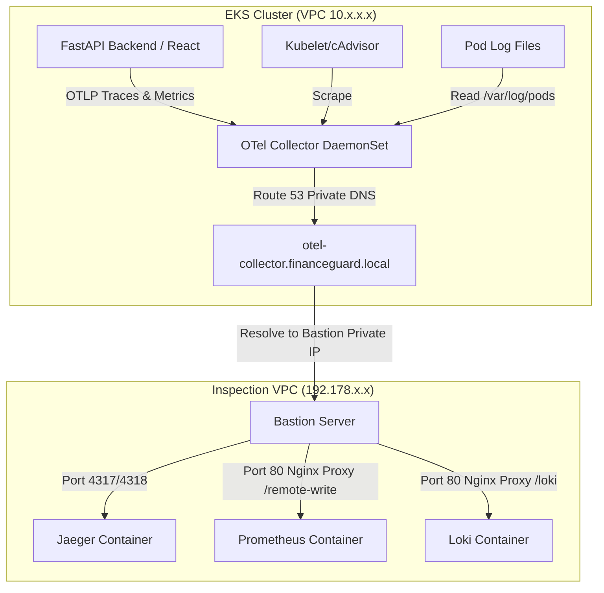

# EKS Cluster and Application Telemetry Forwarding Guide

This guide details how to forward metrics, logs, and traces from your frontend, backend, and EKS clusters to the central monitoring Bastion server using OpenTelemetry (OTel), Prometheus Remote Write, and Grafana Loki.

---

## 1. Architectural Overview

Since EKS clusters run in private VPC subnets and the Bastion server resides in the Inspection VPC, communication occurs securely across the AWS Transit Gateway.



Because Route 53 private DNS associations are active, pods inside EKS resolve `otel-collector.financeguard.local` directly to the Bastion private IP.

---

## 2. Workload Configuration

### A. FastAPI Backend
The backend is already configured to export traces/metrics using the OpenTelemetry SDK. 
To forward these to the Bastion, we inject `OTEL_EXPORTER_OTLP_ENDPOINT` via Helm values (as defined in our environment `values.yaml` files):

```yaml
env:
  - name: OTEL_EXPORTER_OTLP_ENDPOINT
    value: "http://otel-collector.financeguard.local:4317"
```

The OpenTelemetry Python SDK auto-detects this environment variable and forwards all traces/metrics via OTLP (gRPC) directly to the Bastion server.

### B. React Frontend
Because the React frontend runs inside the client's web browser:
1. It **cannot** directly resolve or reach the private DNS `otel-collector.financeguard.local` or the Bastion's private IP.
2. It should forward its OTLP traces to a relative proxy route on the ALB (e.g. `/api/otlp` or `/otlp`), which routes to the backend or a proxy, or use a public gateway.
3. If using standard client-side tracing (using the OpenTelemetry Web SDK), configure the exporter endpoint in your code to target the relative path:
   ```javascript
   const exporter = new OTLPTraceExporter({
     url: '/api/otlp/v1/traces' // Proxy through the ALB to the internal collector
   });
   ```

---

## 3. Automated EKS Telemetry Collector

OpenTelemetry Collector is automatically deployed as a `DaemonSet` on every node in the EKS clusters (`frontend` and `backend`) across all environments (`dev`, `stage`, `prod`) using Terraform's `helm_release` resource pointing to the official `open-telemetry` Helm chart.

### Pipelines Configuration
The collector automatically mounts the necessary host directories (like `/var/log/pods`) and scrapes standard endpoints:

1. **Traces**: Receives traces from application pods (OTLP gRPC/HTTP) and exports them to **Jaeger** via `otel-collector.financeguard.local:4317`.
2. **Metrics**: Scrapes metrics from `kubeletstats` (Node & Container usage stats) and writes them to **Prometheus** via remote write at `http://otel-collector.financeguard.local/prometheus/api/v1/write`.
3. **Logs**: Reads all container pod log files and streams them to **Grafana Loki** at `http://otel-collector.financeguard.local/loki/api/v1/push`.

---

## 4. Verification in Grafana

Once deployed, you can verify your metrics, traces, and logs inside Grafana (`http://<bastion-public-ip>/grafana/`):

1. **Metrics**: Add Prometheus (`http://prometheus:9090`) as a datasource. You can query node metrics (e.g., `kubelet_volume_stats_used_bytes` or `container_cpu_usage_seconds_total`).
2. **Logs**: Add Loki (`http://loki:3100`) as a datasource. You can search container logs using LogQL (e.g., `{namespace="default"}`).
3. **Traces**: Add Jaeger (`http://jaeger:16686` or port `16686`) as a tracing datasource to explore API transaction traces.

