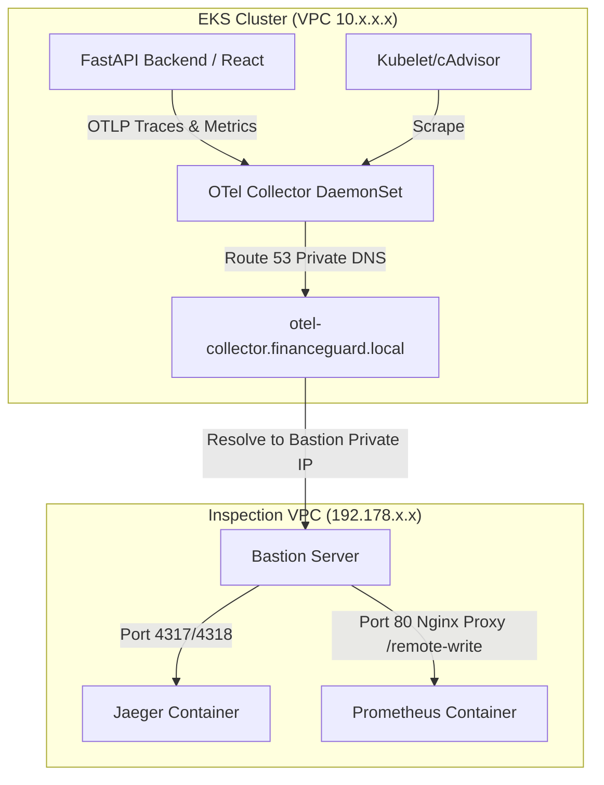

# EKS Cluster and Application Telemetry Forwarding Guide

This guide details how to forward metrics and traces from your frontend, backend, and EKS clusters to the central monitoring Bastion server using OpenTelemetry (OTel) and Prometheus Remote Write.

---

## 1. Architectural Overview

Since EKS clusters run in private VPC subnets and the Bastion server resides in the Inspection VPC, communication occurs securely across the AWS Transit Gateway.



Because Route 53 private DNS associations are active, pods inside EKS resolve `otel-collector.financeguard.local` directly to the Bastion private IP.

---

## 2. Workload Configuration

### A. FastAPI Backend
The backend is already configured to export traces/metrics using the OpenTelemetry SDK. 
To forward these to the Bastion, we inject `OTEL_EXPORTER_OTLP_ENDPOINT` via Helm values (as defined in our environment `values.yaml` files):

```yaml
env:
  - name: OTEL_EXPORTER_OTLP_ENDPOINT
    value: "http://otel-collector.financeguard.local:4317"
```

The OpenTelemetry Python SDK auto-detects this environment variable and forwards all traces/metrics via OTLP (gRPC) directly to the Bastion server.

### B. React Frontend
Because the React frontend runs inside the client's web browser:
1. It **cannot** directly resolve or reach the private DNS `otel-collector.financeguard.local` or the Bastion's private IP.
2. It should forward its OTLP traces to a relative proxy route on the ALB (e.g. `/api/otlp` or `/otlp`), which routes to the backend or a proxy, or use a public gateway.
3. If using standard client-side tracing (using the OpenTelemetry Web SDK), configure the exporter endpoint in your code to target the relative path:
   ```javascript
   const exporter = new OTLPTraceExporter({
     url: '/api/otlp/v1/traces' // Proxy through the ALB to the internal collector
   });
   ```

---

## 3. EKS Cluster Metrics Configuration

To collect cluster-level metrics (node metrics, Pod CPU/memory, etc.) and forward them, deploy an **OpenTelemetry Collector** to the EKS clusters as a DaemonSet/Deployment configured with the following pipelines:

### EKS OTel Collector Configuration (`otel-collector-config.yaml`)

```yaml
apiVersion: v1
kind: ConfigMap
metadata:
  name: otel-collector-config
  namespace: kube-system
data:
  otel-collector-config.yaml: |
    receivers:
      # Scrape Kubernetes node & container metrics
      kubeletstats:
        collection_interval: 15s
        endpoint: "https://${env:K8S_NODE_NAME}:10250"
        auth_type: "serviceAccount"

      # Scrape cluster state metrics (requires kube-state-metrics service)
      prometheus:
        config:
          scrape_configs:
            - job_name: 'kubernetes-service-endpoints'
              kubernetes_sd_configs:
                - role: endpoints
              relabel_configs:
                - source_labels: [__meta_kubernetes_service_annotation_prometheus_io_scrape]
                  action: keep
                  regex: true

    processors:
      batch:

    exporters:
      # Exporter 1: Forward traces to Jaeger on the Bastion
      otlp/jaeger:
        endpoint: "otel-collector.financeguard.local:4317"
        tls:
          insecure: true

      # Exporter 2: Forward metrics to Prometheus Remote Write on the Bastion
      prometheusremotewrite:
        endpoint: "http://otel-collector.financeguard.local/prometheus/api/v1/write"
        tls:
          insecure: true

    service:
      pipelines:
        metrics:
          receivers: [kubeletstats, prometheus]
          processors: [batch]
          exporters: [prometheusremotewrite]
        traces:
          receivers: [otlp] # For apps forwarding their traces to EKS collector
          processors: [batch]
          exporters: [otlp/jaeger]
```

### Deploying the Collector to EKS
1. Apply the OpenTelemetry Collector manifest to your cluster.
2. Ensure the collector's service account has read permissions for the Kubernetes API (ClusterRole to read nodes, pods, services).
3. The metrics will be pushed automatically to the Bastion's Prometheus server, and traces will go to the Jaeger server.
