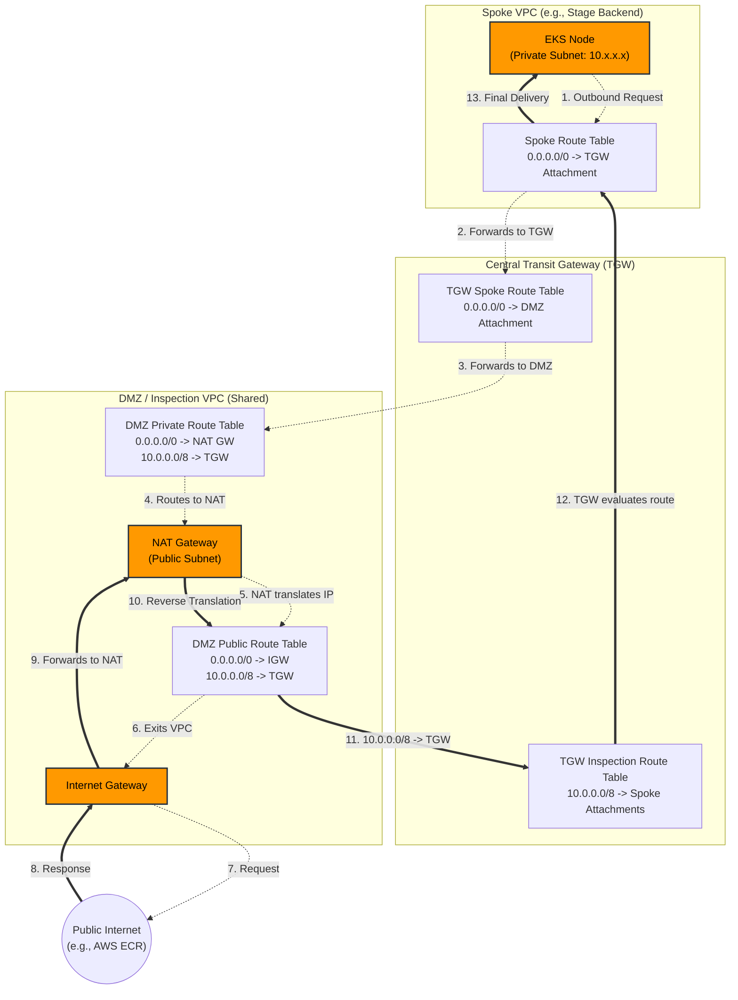

# Network Routing Architecture

This diagram illustrates exactly how traffic flows from your isolated EKS Nodes in a Spoke VPC, out to the internet, and securely back again through your centralized DMZ (Inspection) VPC.

### The Outbound Journey (Egress)
1. Your EKS Node tries to reach `0.0.0.0/0` (the internet).
2. The Spoke VPC Route Table sees the default route we just added and sends the packet to the Transit Gateway.
3. The Transit Gateway receives the packet, looks at the *Spoke Route Table*, and sends `0.0.0.0/0` to the DMZ Attachment.
4. The DMZ Private Route Table receives it and routes it to the NAT Gateway.
5. The NAT Gateway masks the internal IP address and sends it out the Internet Gateway to the web.

### The Return Journey (Ingress)
1. The internet responds, and the packet arrives at the Internet Gateway.
2. It hits the NAT Gateway, which un-masks the IP back to the original `10.x.x.x` EKS Node address.
3. **(The Bonus Fix):** The DMZ Public Route Table sees the destination is `10.x.x.x`, matches the `10.0.0.0/8` route we added, and fires the packet back to the Transit Gateway.
4. The Transit Gateway uses the *Inspection Route Table* to figure out exactly which Spoke VPC the `10.x.x.x` IP belongs to.
5. The packet drops into the Spoke VPC and arrives safely at the EKS Node.
